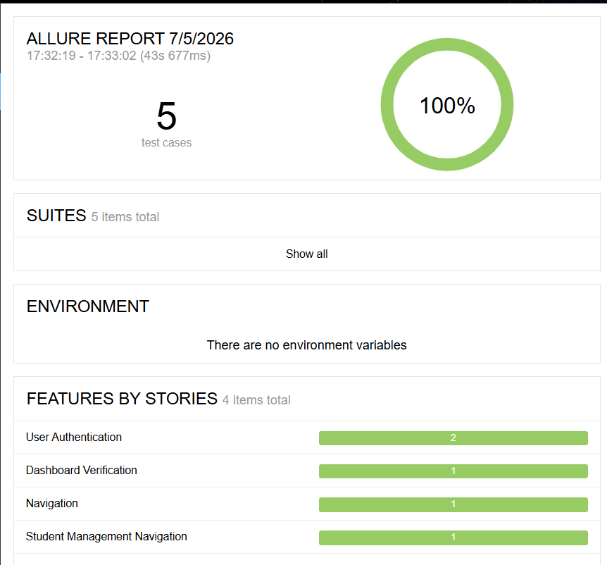

# 🎭 SoftTechverse Education Portal — BDD Test Automation Framework
 https://education.softtechverse.com

A professional, enterprise-grade test automation suite built for the **SoftTechverse Education Portal** . This project implements the **Page Object Model (POM)** design pattern combined with **Behavior-Driven Development (BDD)** using Python's **Behave** framework and **Selenium WebDriver**.


## 📊 Automated Test Execution Reports

Here are the automated execution reports generated by the framework:

### 1. Test Execution Run Output


### 2. Scenario Run Summary


### 3. Detailed Step execution log


---

## 📂 Project Structure

```text
SoftTechverse/
│
├── features/                           # Gherkin Scenario Files (.feature)
│   ├── authentication/
│   │   └── login.feature               # Login validation (smoke and negative scenarios)
│   ├── dashboard/
│   │   └── dashboard.feature           # Verifies dashboard rendering and main layouts
│   ├── students/
│   │   └── student_management.feature  # Sidebar expansion and Student List visibility
│   └── navigation/
│       └── navigation.feature          # Direct access redirects for unauthenticated users
│
├── steps/                              # Python Step Definitions
│   ├── auth_steps.py                   # Authentication step implementations
│   ├── dashboard_steps.py              # Dashboard assertions and setups
│   ├── student_steps.py                # Student module interaction steps
│   └── navigation_steps.py             # Route security checks
│
├── pages/                              # Page Object Model Class Files
│   ├── base_page.py                    # Wrapper for selenium actions (clicks, types, waits)
│   ├── login_page.py                   # Locators & actions for the Authentication page
│   ├── dashboard_page.py               # Locators & actions for the Dashboard panel
│   ├── student_page.py                 # Locators & actions for the Student Details section
│   └── navigation_page.py              # Navigation links handlers
│
├── utils/                              # Framework Configuration & Utilities
│   ├── config.py                       # Global variables, base URL, timeouts, and credentials
│   └── driver_factory.py               # Multi-browser setup factory (Chrome, Firefox, Edge)
│
├── environment.py                      # Behave hooks for setup, teardown & error screenshots
├── behave.ini                          # Behave global runner configuration
├── requirements.txt                    # Project python dependencies
└── .gitignore                          # Exclusions for python caches, virtual envs, and report outputs
```

---

## 📋 Scenarios Covered

| Feature | Scenario | Tags | Objective |
|---|---|---|---|
| **User Authentication** | Successful login with valid credentials | `@smoke`, `@login` | Checks that valid credentials redirect successfully to the dashboard. |
| **User Authentication** | Login fails with invalid credentials | `@login`, `@negative` | Confirms validation errors and ensures user remains on login page. |
| **Dashboard Verification**| Dashboard loads after login | `@smoke`, `@dashboard`| Verifies page layout elements and sidebar rendering. |
| **Navigation Security** | Unauthenticated user is redirected | `@smoke`, `@navigation`| Ensures direct URL access without session redirects back to login page. |
| **Student Management** | Expand Student Details menu | `@smoke`, `@student` | Confirms sidebar submenu navigation works correctly. |

---


## Setup & Execution Guide

### 1. Clone the repository

git clone <your-repository-url>

### 2. Configure Virtual Environment

# Create environment
python -m venv myenv

# Activate virtual environment
myenv\Scripts\activate


### 3. Install Requirements
Install all dependencies listed in `requirements.txt`:
pip install -r requirements.txt


### 4. Execute Automated Suite
# Run all scenarios
behave


